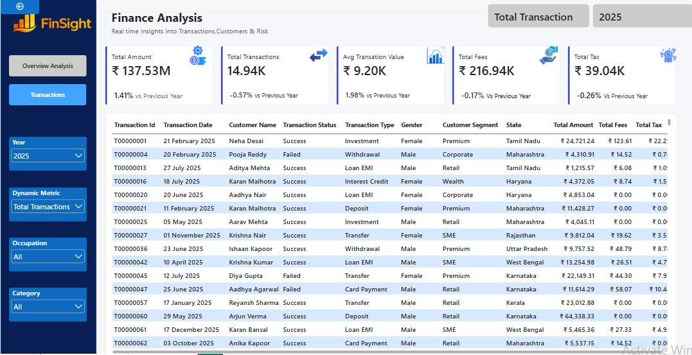

 Finance Analysis Dashboard
 📊 Project Overview
An interactive Power BI Finance Analytics Dashboard designed to analyze financial transactions, customer segments, transaction types, fees, taxes, and transaction trends.
The dashboard provides an easy-to-understand view of financial performance and customer transaction behavior.
🎯 Objectives
The main objectives of this project are:
- Analyze total transaction amount
- Monitor transaction volume and trends
- Understand average transaction value
- Analyze transaction fees and taxes
- Compare successful, failed, and pending transactions
- Analyze transactions by customer segment
- Analyze transactions across different states
- Understand transaction behavior by gender
- Compare different transaction types
📌 Dashboard Pages
### 1. Overview Analysis
The Overview Analysis page provides a high-level summary of financial performance.
Key KPIs include:
- Total Amount
- Total Transactions
- Average Transaction Value
- Total Fees
- Total Tax
The page also provides visual analysis of:
- Monthly transactions
- Transaction status
- Customer segment
- State
- Transaction type
- Gender
### 2. Transactions
The Transactions page provides detailed transaction-level information.
The table includes fields such as:
- Transaction ID
- Transaction Date
- Customer Name
- Transaction Status
- Transaction Type
- Gender
- Customer Segment
- State
- Total Amount
- Total Fees
- Total Tax
## 🛠️ Tools & Technologies
- Microsoft Power BI
- Power Query
- DAX
- Data Visualization
- Data Analytics
## 📈 Key Dashboard Metrics
For the displayed 2025 dashboard:
- Total Amount: ₹137.53M
- Total Transactions: 14.94K
- Average Transaction Value: ₹9.20K
- Total Fees: ₹216.94K
- Total Tax: ₹39.04K
## 📷 Dashboard Preview
### Overview Analysis

Transactions

## 🔑 Key Insights
- Processed **₹137.53M** across **14.94K transactions** in 2025.
- Average transaction value reached **₹9.20K**, increasing by **1.98% YoY**.
- Total transaction value increased by **1.41% YoY**, despite a **0.57% decline** in transaction volume.
- Approximately **85.8% of transactions were successful**, with 10.1% failed and 4.0% pending.
- **Retail customers** generated the highest transaction volume at approximately **8.1K transactions**.
- **Loan EMI and Transfer transactions** contributed the highest transaction values, at approximately **₹40.0M** and **₹36.2M**, respectively.
